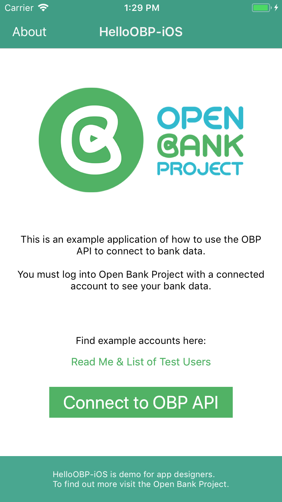
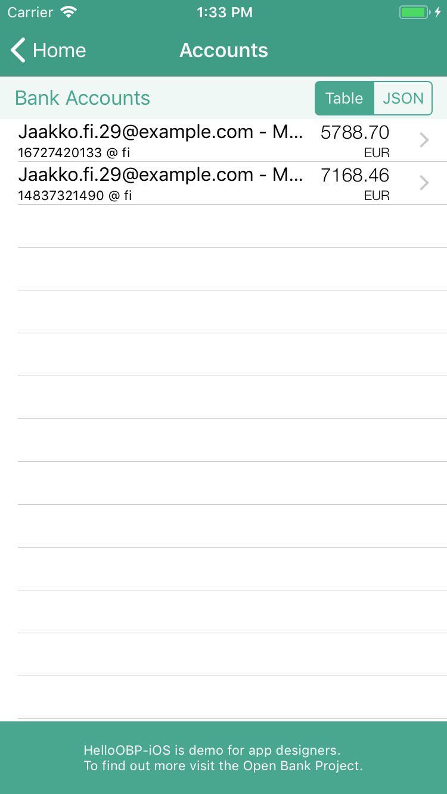

Hello-OBP-OAuth1.0a-iOS
========================

This demonstration app...

* talks to Open Bank Project's API sandbox
* handles authorization
* retrieves banks, accounts and transactions 
* allows you to make simple transfers between accounts.

**Note 1:** if you are attending a Hackathon and reading this, you can easily modify this app to talk to the OBP server at the hackathon by following the instructions in the `DefaultServerDetails.h` header file; then you can build and use it to look at the data available at the hackathon.

**Note 2:** to start your own app, the [OBP-iOS-Starter](https://github.com/OpenBankProject/OBP-iOS-Starter), written in Swift, is ready for you to copy and extend. It contains the necessary calls to handle authorisation, and a minimal sample query of the API (get banks).

Both this and the starter app use [OBPKit](https://github.com/OpenBankProject/OBPKit-iOSX), which does the authorisation heavy lifting for you and offers easy calls for interacting with the API. Get to know the entire API using the [API Explorer][], and discover more about the sandbox at the [Sandbox Overview][].

## Login credentials

The sandbox overview page has sample login credentials at [Customer Logins][] which allow you to view a variety of test data — try, for example, jaakko.fi.29@example.com (password: 8132cf) or ellie.de.29@example.com (password: 2efb1f).

Also follow the [Create Bank Account][] link on the sandbox home page, create a few test accounts with your own OBP credentials, and then launch the app, login and experiment with transfers.

## Installation

To install the project source, clone the git repo and then according to your preference, run [Carthage][] ([install][Carthage-install]) or [CocoaPods][] ([install][CocoaPods-install]).

I.e. first...

```sh
$ cd somewhere-suitable
$ git clone https://github.com/OpenBankProject/Hello-OBP-OAuth1.0a-iOS.git HelloOBP-iOS
Cloning into 'HelloOBP-iOS'...
remote: Counting objects: 478, done.
remote: Compressing objects: 100% (82/82), done.
remote: Total 478 (delta 27), reused 0 (delta 0), pack-reused 392
Receiving objects: 100% (478/478), 2.05 MiB | 948.00 KiB/s, done.
Resolving deltas: 100% (180/180), done.
Checking connectivity... done.
```

...then either use Carthage...

```sh
$ cd HelloOBP-iOS
$ carthage update --no-build --no-use-binaries 
*** Fetching OBPKit-iOSX
*** Fetching UICKeyChainStore
*** Fetching STHTTPRequest
*** Fetching OAuthCore
*** Checking out OAuthCore at "0.0.2"
*** Checking out STHTTPRequest at "1.1.4"
*** Checking out UICKeyChainStore at "v2.1.1"
*** Checking out OBPKit-iOSX at "1.1.3"
$ open HelloOBP-iOS-Cart.xcworkspace -a Xcode.app
```

...and then build and run, or use CocoaPods...

```sh
$ cd HelloOBP-iOS
$ pod install 
Analyzing dependencies
Pre-downloading: `OAuthCore` from `https://github.com/t0rst/OAuthCore.git`, commit `03121e6b8bc7ba3dea07df1289546134b192b494`
Pre-downloading: `OBPKit` from `https://github.com/OpenBankProject/OBPKit-iOSX.git`, commit `bb55d0add08e7da87844bfc3108d88a9e8b467a7`
Downloading dependencies
Installing OAuthCore (0.0.2)
Installing OBPKit (1.0.0)
Installing STHTTPRequest (1.1.0)
Installing UICKeyChainStore (2.1.0)
Generating Pods project
Integrating client project
[!] Please close any current Xcode sessions and use `HelloOBP-iOS-Pods.xcworkspace` for this project from now on.
Sending stats
Pod installation complete! There are 2 dependencies from the Podfile and 4 total pods installed.
[!] CocoaPods did not set the base configuration of your project because...
$ open HelloOBP-iOS-Pods.xcworkspace -a Xcode.app
```

...then one extra, not-yet-automated step that is needed with the latest CocoaPods (`pod --version` >= 1.0.0): in the navigator pane, click on the blue HelloOBP-iOS project icon, select HelloOBP-iOS under TARGETS, select Build Phases, click the 'x' to the right of the "Embed Frameworks (4 items)" build phase, as CocoaPods has installed it own "[CP] Embed Pods Frameworks" build phase further down (committing this change now will allow you to easily revert it should you wish to try out using carthage later), and then...

...build and run. 

You can ignore the two pod warnings starting "CocoaPods did not set the base configuration of your project because...etc", because HelloOBP-iOS.xcodeproj configures for carthage or cocoapods whenever you build: a script sets the build configuration files Debug(dynamic).xcconfig and Release(dynamic).xcconfig to be copies of Debug(carthage).xcconfig and Release(carthage).xcconfig or Debug(cocoapods).xcconfig and Release(cocoapods).xcconfig, as appropriate. This sometimes goes under Xcode's radar, and you get a warning, but this clears after you clean, close and reopen the project.

## Support

Questions? Contact `@tesobe_t0rst` on the [Open Bank Project's Slack Team](https://openbankproject.slack.com).

## Screenshots

 

 

 

## LICENSE

This demo app is licensed under the [Apache License, Version 2.0](http://www.apache.org/licenses/LICENSE-2.0.html).

[Carthage]: https://github.com/Carthage/Carthage/blob/master/README.md
[Carthage-install]: https://github.com/Carthage/Carthage/blob/master/README.md#installing-carthage
[CocoaPods]: https://github.com/CocoaPods/CocoaPods/blob/master/README.md
[CocoaPods-install]: http://guides.cocoapods.org/using/getting-started.html#installation
[API Explorer]: https://apiexplorersandbox.openbankproject.com
[Sandbox Overview]: https://github.com/OpenBankProject/OBP-API/wiki/Sandbox
[Customer Logins]: https://github.com/OpenBankProject/OBP-API/wiki/Sandbox#customer-logins
[Create Bank Account]: https://apisandbox.openbankproject.com/create-sandbox-account

